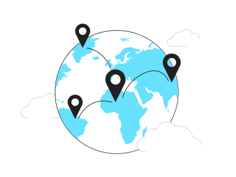

# Welcome to My GitHub Profile!

##  About Me

Hi there, I'm Maksym Noritsyn, currently working as a Python Developer at NZT Team. My expertise lies in backend development, with a keen interest in Python, FastAPI, and aiogram. I'm also proficient in HTML, CSS, JavaScript, and have experience in TensorFlow for computer vision projects.

 **Education**: I'm pursuing a Master's Degree in Software Engineering at GOIT Neoversity, where I'm honing my skills as a Full Stack Developer.

##  Professional Highlights
**Current Role:** Python Developer at NZT Team, working on web applications and integrating OpenAI bots.

**Freelance Experience:** Specialized in synthetic data generation for neural networks and developing projects in FastAPI.

**Technical Skills:**

  

##  My Motivation
I am driven by the desire to build applications that improve people's lives. I thrive on creating products that are not only functional but also widely used and impactful.

##  Connect with Me
- [LinkedIn](https://www.linkedin.com/in/maximnoritsyn/)

Thank you for visiting my profile. I'm always open to collaborating on innovative projects and ideas. Let's create something incredible together!
